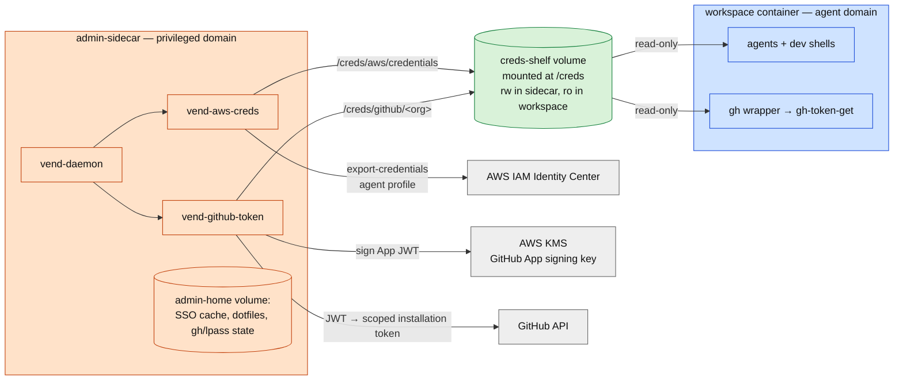
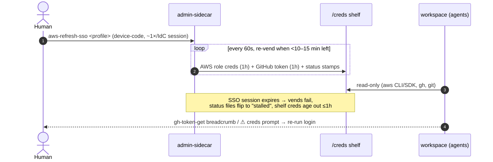

# Workspace devcontainer: agent/admin credential isolation

This devcontainer is split into **two trust domains**: the `workspace` container where coding
agents (and day-to-day dev shells) run, and the `admin-sidecar` container which is the human's
privileged environment. Credentials flow between them in exactly one direction, through a
read-only "shelf". Design discussion: [twin-digital/opus#164](https://github.com/twin-digital/opus/issues/164).

## Why

Agents execute arbitrary tool calls in the workspace. Anything readable there — env vars, files,
sockets — must be assumed agent-accessible, so long-lived or broad credentials cannot live there:

- The **SSO session** (which can mint *every* role assigned to the user) stays in the sidecar.
- The **GitHub App signing key** never leaves AWS KMS; even the sidecar only asks KMS to sign.
- The workspace receives only **short-lived (≤1h), pre-scoped** credentials. An agent cannot
  widen its own scope: scope is decided by vend scripts it cannot edit (sidecar image) and
  IAM/App configuration it cannot reach.
- Escalation is human-shaped: you vend something broader from the sidecar, time-boxed.

The container boundary is the enforcement point. That's also why the workspace gets **no Docker
socket** (a writable `docker.sock` is root-equivalent on the host and would void every boundary
above — see #164 for the external agent-daemon replacement plan).

## Architecture

- **`admin-sidecar`** (`.devcontainer/admin-sidecar/`): Ubuntu image with `aws` (v2), `gh`,
  `lpass`, `ansible`, `terraform`, `jq`/`yq`. Home is a private volume the workspace never
  mounts. Enter from a **host** terminal: `docker exec -it admin-sidecar bash` (or VS Code
  "Attach to Running Container"). No sshd — host Docker access is the gate.
- **Vend loops**, supervised by `vend-daemon` (the sidecar's main process,
  `docker logs admin-sidecar`):
  - `vend-aws-creds` — exports credentials for the profiles in `VEND_AWS_PROFILES`
    (docker-compose.yml) into `/creds/aws/credentials`. First profile doubles as `[default]`;
    agents select others with `AWS_PROFILE=<name>`.
  - `vend-github-token` — one loop **per GitHub App installation** listed in
    `admin-sidecar/github-installations.json` (one installation == one org). Each signs the App
    JWT via KMS (profile `VEND_GH_AWS_PROFILE`), exchanges it for an installation token narrowed
    by that entry's `repos`/`perms`, and writes `<exp_epoch> <token>` to `/creds/github/<org>`.
    **The shelf filenames are the org→token routing table.**
  - Statuses: `/creds/status/aws` and `/creds/status/github-<org>` per cycle: `ok expires=...`
    or `stalled since=... fix=...`. File mtime is a heartbeat (stale >5 min ⇒ loop not running).
- **Workspace consumption**: `AWS_SHARED_CREDENTIALS_FILE=/creds/aws/credentials` (containerEnv).
  For GitHub, the consuming side **routes per org** — the shelf is the workspace's *only* GitHub
  credential source; nothing in the workspace can mint:
  - `gh-shelf-resolve [org]` is the shared resolver: an explicit org → `/creds/github/<org>`;
    else `$GH_TOKEN_SHELF`; else `$GH_DEFAULT_ORG` (containerEnv, the workspace's primary org);
    else the sole vended token if there's exactly one.
  - The `gh` wrapper detects the target org (`GH_ORG`, a `-R/--repo` flag, `GH_REPO`, or the
    cwd's origin remote) and fetches that org's token via `gh-token-get <org>`.
  - `git-credential-shelf` (wired system-wide for `github.com` with `useHttpPath`) routes on the
    org in the request path, so `git` against any org's repo gets the right token.
  - On failure, `gh-token-get` prints a diagnosis to stderr (fail-open on stdout).
  - CI is independent: it KMS-mints its own tokens inline in `publish.yaml`.

## Credential lifecycles

| Credential | Lifetime | Renewal | Human action |
|---|---|---|---|
| GitHub token (`/creds/github/<org>`, one per org) | 1h (GitHub-fixed) | auto, <10 min left | none |
| Agent AWS creds (`/creds/aws/credentials`) | 1h (permission-set duration) | auto, <15 min left | none |
| SSO access token | ~1h | silent refresh-token renewal | none |
| **Identity Center session** | org setting (8h default) | device-code login in sidecar | **the one recurring step** |
| SSO client registration | ~90 days | auto at next login | none |
| KMS App key | permanent, non-extractable | — | none |

## Daily use

- **Login** (when the IdC session lapses), from a host terminal:
  `docker exec -it admin-sidecar bash` then `aws-refresh-sso <any twin-digital profile>` —
  device-code flow (`AWS_SSO_USE_DEVICE_CODE=1` is set in the sidecar). One login revives both
  vend loops within 60s.
- **Health**: `cat /creds/status/*` from either container, or `docker logs -f admin-sidecar`.
- **Privileged work** (terraform/ansible/lpass/gh-as-you): do it *in the sidecar*, which mounts
  `/workspace`. Remember the source you apply there is agent-writable — review diffs before
  `terraform apply` etc.

## Troubleshooting

| Symptom | Meaning | Fix |
|---|---|---|
| `ExpiredToken` from aws in workspace | shelf creds aged out (vend stalled) | login in sidecar (see Daily use) |
| `gh`/`git` unauthenticated (401/404) + stderr breadcrumb | same, GitHub side | same |
| `/creds/status/*` says `stalled since=...` | that vend loop can't reach SSO/KMS | `docker logs admin-sidecar` for the error; usually login |
| `gh`/`git` wrong-org or "could not resolve a token file" | no org context and >1 org vended, or `GH_DEFAULT_ORG` unset/mismatched | pass `-R <org>/<repo>` / set `GH_DEFAULT_ORG` to a vended org |
| status file mtime >5 min old | vend loop/container not running | `docker compose up -d admin-sidecar` (host) |
| `/creds` missing in workspace | container built without the shelf mount | rebuild workspace container |
| sidecar `aws sso login` hangs on callback | no port forwarding to sidecar | use the device-code flow (default here) |

## Changing scope / escalation

- Standing AWS scope: edit `VEND_AWS_PROFILES` in `docker-compose.yml`,
  `docker compose up -d admin-sidecar`.
- Standing GitHub scope: edit the relevant entry's `repos`/`perms` in
  `admin-sidecar/github-installations.json`, then rebuild the sidecar (the file is baked into
  the image — see Change discipline).
- One-off escalation: from a sidecar shell, run a vend script with overrides, e.g.
  `VEND_GH_TOKEN_NAME=elevated VEND_GH_INSTALLATION_ID=<id> VEND_GH_PERMS='{...}' vend-github-token --once`
  — it lands at `/creds/github/elevated` and expires ≤1h like everything else on the shelf.

## Adding repos and orgs

A GitHub App **installation is per-org**; one `vend-github-token` loop serves one installation,
writing `/creds/github/<org>`. The consuming side routes on org automatically (`gh` by
flag/remote, `git` by request path), so adding coverage is a config change, not a code change.

**Another repo in the same org:**
1. If the App isn't installed on that repo, add it (GitHub → org Settings → GitHub Apps →
   configure the App's repository access).
2. Add the repo name to that org's `repos` array in `admin-sidecar/github-installations.json`;
   rebuild the sidecar. The org's existing token now covers it — `gh`/`git` need no changes.

**A repo in a different org:**
1. Install the App on that org (its admin approves; pick the repo grant). Note the new
   installation id: `https://github.com/organizations/<org>/settings/installations/<id>`.
2. Append an entry to `admin-sidecar/github-installations.json`:
   `{ "org": "<org>", "installation_id": "<id>", "repos": ["<repo>"] }`; rebuild the sidecar.
   `vend-daemon` starts a second loop vending `/creds/github/<org>`.
3. Nothing else. `gh -R <org>/<repo> ...`, `gh` run inside that org's checkout, and
   `git` against it all route to the new token automatically. (`GH_DEFAULT_ORG` only picks which
   org answers when there's *no* repo context.)

## Change discipline

These `.devcontainer` files live on the agent-writable `/workspace` mount. Changes only take
effect when a **human rebuilds/recreates** the containers — so *review the diff of this
directory before any rebuild*; it is part of the security model.

## Rebuilding (keep workspace + sidecar in one compose project)

Both services share the `creds-shelf` volume **only when they're in the same compose project** —
Docker names volumes `<project>_creds-shelf`. VS Code launches the workspace under a project like
`workspace_devcontainer`; a bare `docker compose up -d admin-sidecar` from the host defaults the
project to the directory name (e.g. `devcontainer`), creating a *second*, orphaned sidecar on a
*different* volume that the workspace can't read (the `container_name: admin-sidecar` override
hides this — same name, different project). Symptom: the sidecar logs `vended` but the workspace
sees stale/no tokens.

So: **rebuild from VS Code** ("Dev Containers: Rebuild Container"), which recreates both services
in one project. To (re)build just the sidecar from the host, pass the workspace's project name:
`docker compose -p workspace_devcontainer up -d --build admin-sidecar`. After a rebuild the
sidecar's home volume may be fresh, so re-run `aws-refresh-sso <profile>` once to restore the SSO
session.
